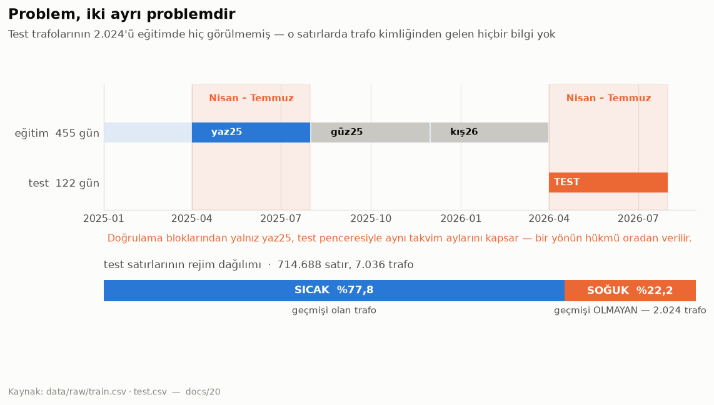
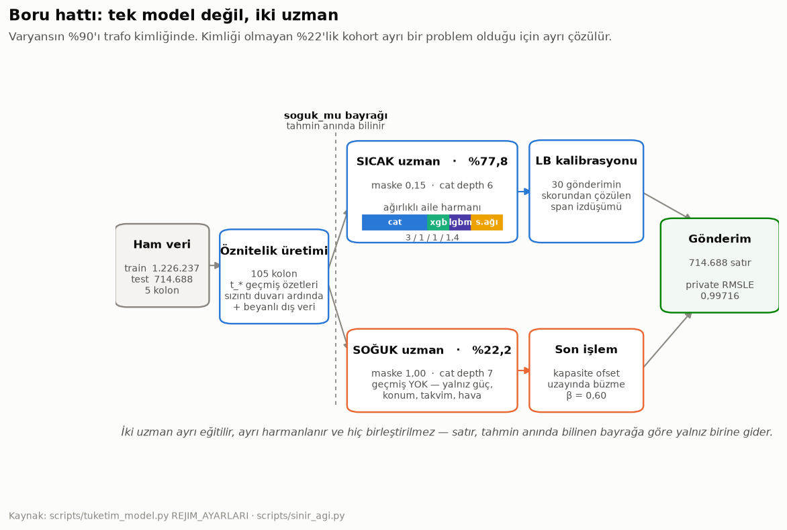
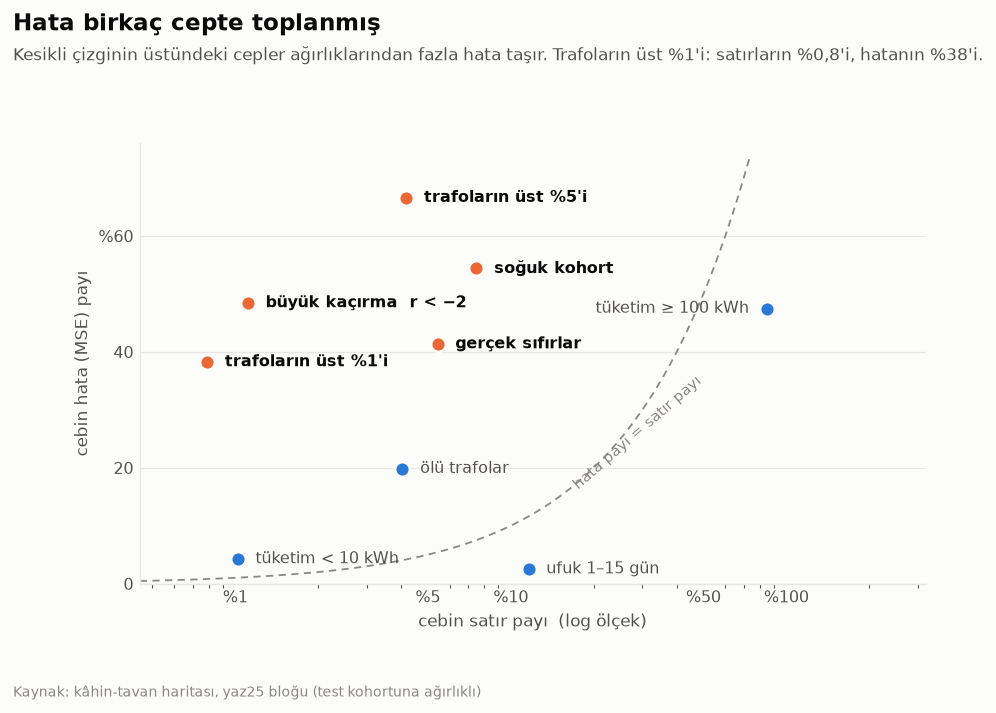
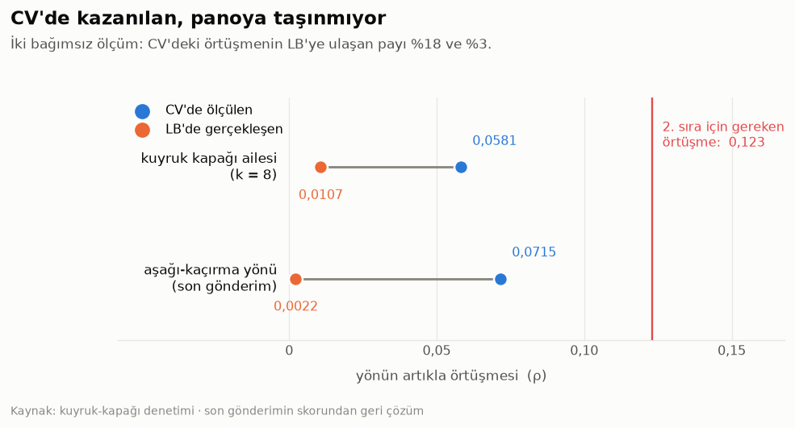
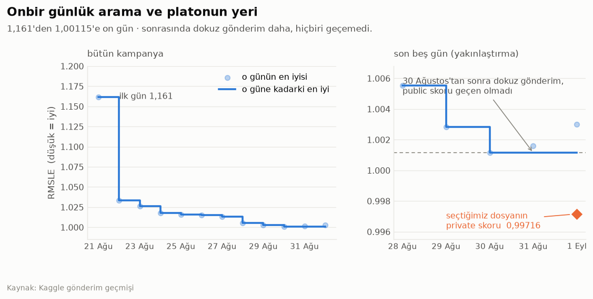

# Grid Up Datathon 2026 — TasnifX

**Trafo bazlı günlük elektrik tüketimi tahmini** · Coderspace × GDZ Elektrik × ADM Elektrik
21 Ağustos – 1 Eylül 2026 · Kaggle In-Class · 493 takım

| | |
|---|---|
| **Görev** | 7.036 dağıtım trafosunun 2026-04-01 → 2026-07-31 arası günlük tüketimi (kWh) |
| **Metrik** | RMSLE |
| **Sonuç** | private **0,99716** · public 1,00115 · 36 gönderim |
| **Notebook** | [kaggle.com/code/cemzal/grid-up-datathon-2026-tasnifx](https://www.kaggle.com/code/cemzal/grid-up-datathon-2026-tasnifx) |

Bu depo yarışmanın tamamını taşıyor: çalışan boru hattı, 80 karar belgesi ve
548 ölçüm betiği. Buradaki hiçbir sayı elle yazılmadı — her birinin yanında onu
üreten betik ya da belge yazılı.

---

## Problem: aslında iki problem



Tüketim varyansının **%90,1'i trafonun kendi kimliğinden** gelir (log1p uzayında,
1.226.237 eğitim satırında ölçüldü). Ama test trafolarının 2.024'ü eğitimde hiç
görülmemiş: satırların **%22,16'sı** için trafo kimliğinden gelen *hiçbir* bilgi yok.

Bu iki kohort tek bir problem değil:

| | satır payı | ölçülen RMSLE | hata (MSE) payı |
|---|---|---|---|
| **sıcak** (geçmişi olan) | %77,8 | 0,735 | %42,0 |
| **soğuk** (geçmişi olmayan) | %22,2 | 1,621 | **%58,0** |

Satırların beşte biri, hatanın yarısından fazlasını taşıyor.

## Çözüm: iki uzman



Tek model yerine iki uzman; her biri kendi maskeleme oranı, kendi ağaç derinliği ve
kendi harmanıyla eğitilir. Satır, tahmin anında bilinen `soguk_mu` bayrağına göre
yalnız birine gider — çıktılar hiç birleştirilmez.

- **Sıcak uzman:** CatBoost / XGBoost / LightGBM / sinir ağı harmanı, ağırlık 3 / 1 / 1 / 1,4
- **Soğuk uzman:** yalnız CatBoost — geçmiş öznitelikleri tanımsız olduğu için
- **Son işlem:** soğuk tahminlerde kapasite-ofset uzayında büzme (β = 0,60)
- **Seviye:** modelden değil, gönderim skorlarından çözülen span izdüşümünden

## Üç bulgu

**1 · Hata birkaç cepte toplanmış.**



Trafoların üst %1'i satırların %0,8'ini oluşturuyor ama hatanın %38'ini taşıyor.
Her cep için önce *kâhin tavanı* (o cebi mükemmel çözsek ne kazanırdık) hesaplandı,
sonra o cebe üyeliğin gözlenebilir özniteliklerden ne kadar kestirilebildiği
blok-dışı ölçüldü.

**2 · Sıfır cebi ölçülerek kapatıldı.**
Sıfır satırlar hatanın %41'ini taşıyor ve sınıflandırıcı blok-dışı AUC 0,974 veriyor
— yine de hiçbir büzme varyantı kazanmadı. Sebep ölçüldü: yakalanabilen sıfırlar
hatanın yalnızca %1,5'i (model onlara zaten log 0,26 veriyor), hatanın %39,8'i
*yakalanamayan* kümede ve orada model log 5,05 tahmin ediyor.

**3 · Çapraz doğrulamada kazanılan, panoya taşınmıyor.**



İki bağımsız ölçüm: bir yönün CV'de görünen değerinin leaderboard'a ulaşan payı
%18 ve %3. Sebep mevsimsel taşınamazlık — her doğrulama bloğu kendi takvim aylarını
eğitimde göremiyor, üretim modeli ise görüyor. Blok *içinde* artığın %83'ü
öğrenilebiliyor, blok *dışında* sıfır.

Bu yüzden doğrulama bloklarından yalnız **yaz25** hüküm verir: test penceresiyle
(Nisan–Temmuz) aynı takvim aylarını kapsayan tek blok odur.

## Kampanya



On bir gün, 36 gönderim. İlk gün 1,161; 30 Ağustos'ta 1,00115. Sonrasında dokuz
gönderim daha yapıldı ve **hiçbiri public skoru geçemedi** — o noktadan sonrası
arama değil ölçümdü: her gönderim leaderboard geometrisinde bir yönün katsayısını
çözdü.

---

## Tekrar üretim

```powershell
git clone https://github.com/cozalss/Grid-Up-Datathon---TasnifX.git
cd Grid-Up-Datathon---TasnifX

python -m pip install --require-hashes -r requirements/uv-bootstrap.txt
uv sync --locked --extra full --extra dev

uv run python scripts/ekip_kontrol.py   # kurulum doktoru, ~3 sn
uv run python -m pytest -q              # testler
uv run python scripts/smoke_test.py     # sentetik veriyle uçtan uca, ~42 sn
```

Yarışma verisini `data/raw/` altına koyduktan sonra üretim hattı:

```powershell
uv run python scripts/tuketim_model.py
uv run python scripts/kapi_denetim.py   # 714.688 satır, 0 NaN, 0 negatif, ID sırası
```

## Depo haritası

| dizin | içerik |
|---|---|
| `notebooks/TasnifX_final.ipynb` | jüriye sunulan notebook — Kaggle sürümüyle aynı |
| `scripts/` | üretim hattı (`tuketim_model.py`, `sinir_agi.py`), denetim ve yardımcı betikler |
| `src/` | paket kodu (öznitelik üretimi, doğrulama, metrik) |
| `docs/` | 80 karar belgesi — her hükmün gerekçesi ve ölçümü, tarih sırasıyla |
| `experiments/` | ölçüm betikleri; her biri tek bir soruyu kapatır |
| `tests/` | 92 test |
| `data/prior/` | 2023 provası için halka açık kesinti verisi (11 MB, kaynağı `data/sources.yml`) |

Ara çıktılar (`.npy` / `.npz` önbellekleri, koşu logları) depoda taşınmaz;
hepsi ilgili betikten yeniden üretilebilir.

## Dış veri

Dış kaynak kullanıldı ve notebook'un 3. bölümünde tam olarak beyan edildi:
her kaynağın adı, kapsamı, lisansı ve modele hangi kolonla girdiği listeli.
Modele **girmeyen** ama depoda bulunan kaynaklar da ayrıca işaretlendi.
Makine tarafından okunabilir envanter: [`data/sources.yml`](data/sources.yml).

## Lisans

[MIT](LICENSE) — kod. Dış veri kaynakları kendi lisanslarına tabidir
(`data/sources.yml`).
